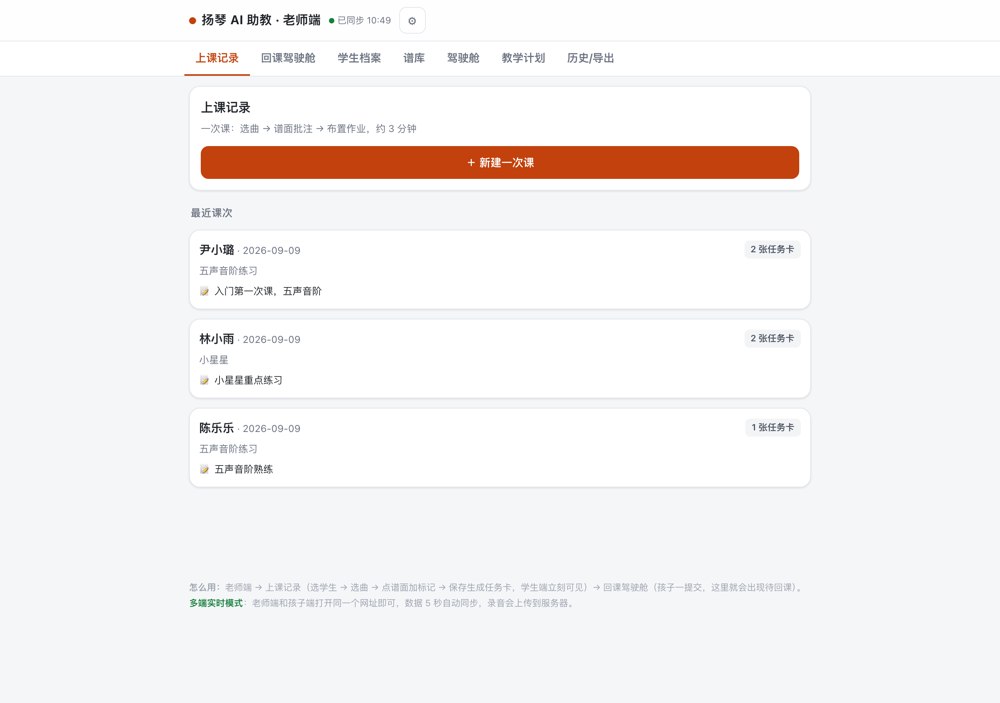
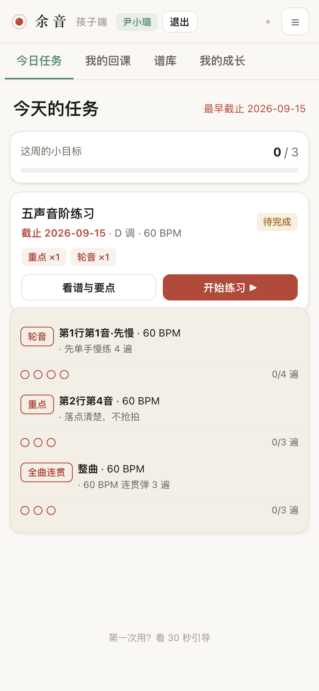
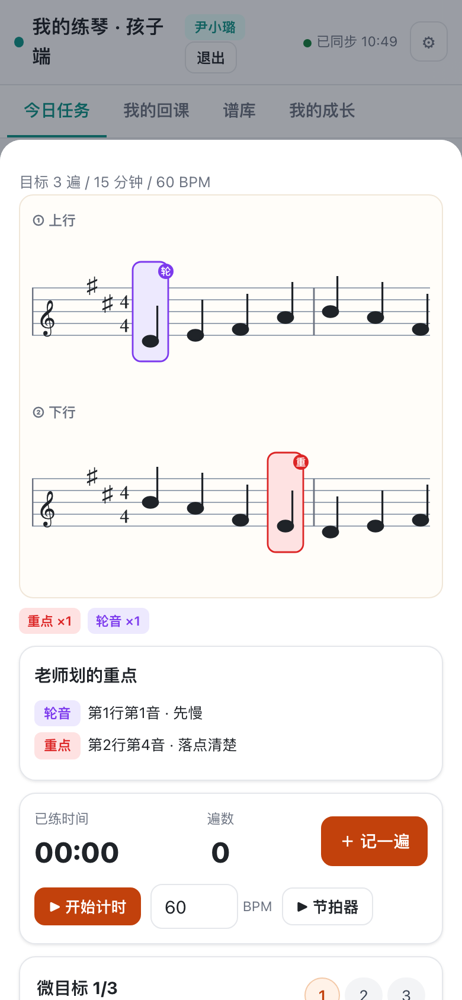
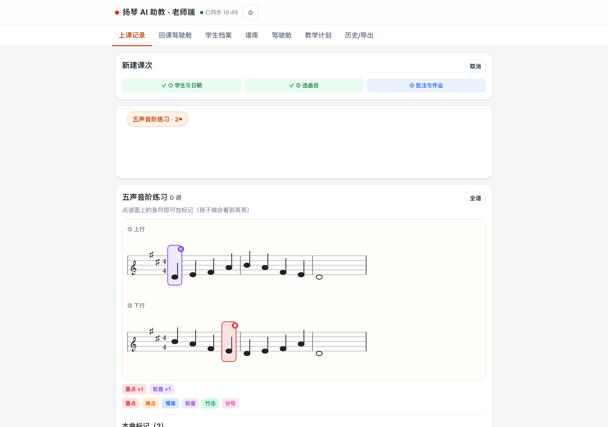
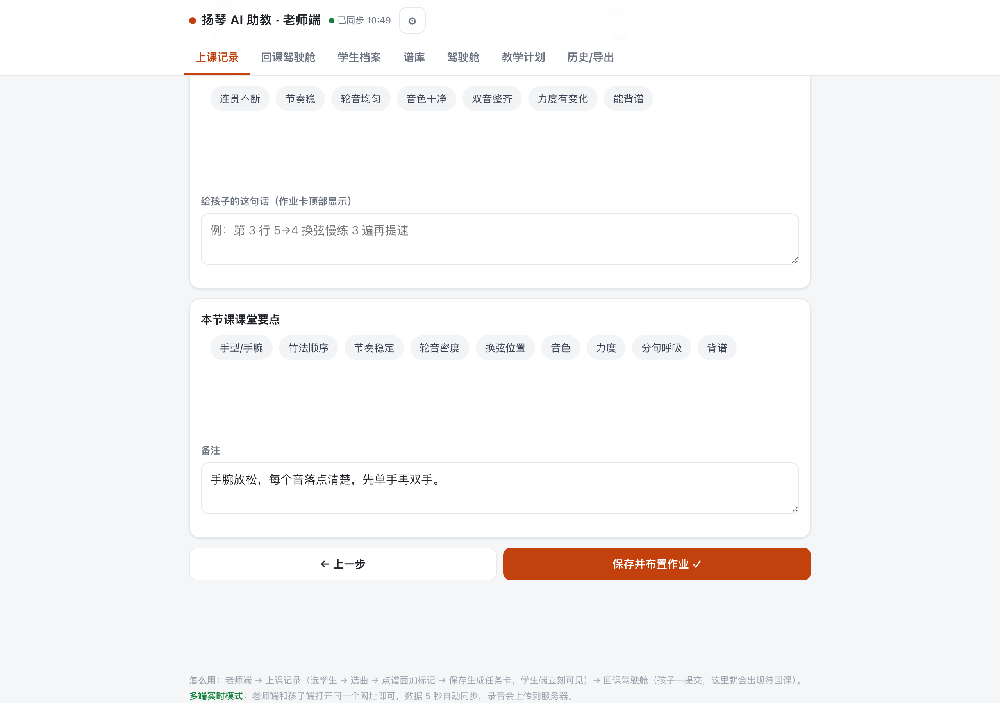
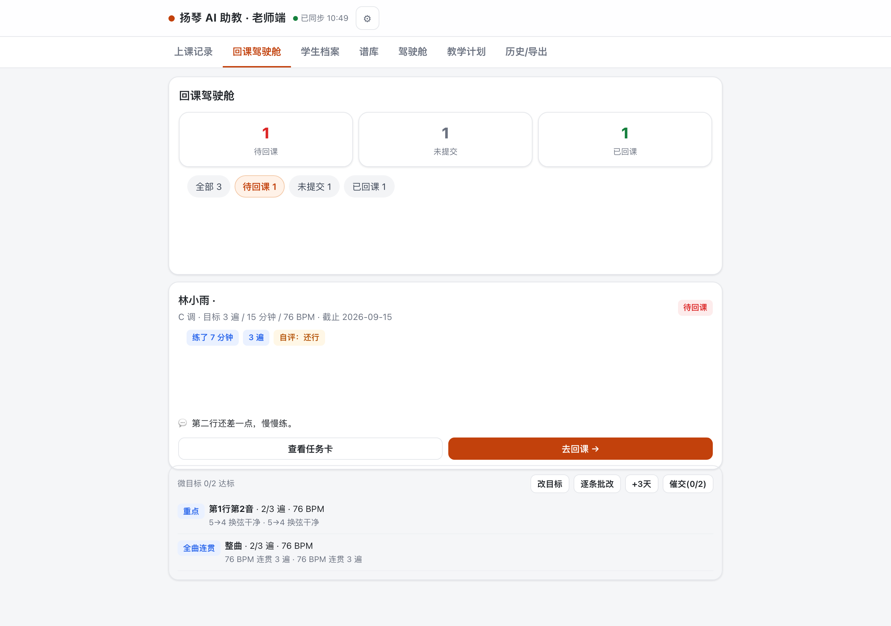
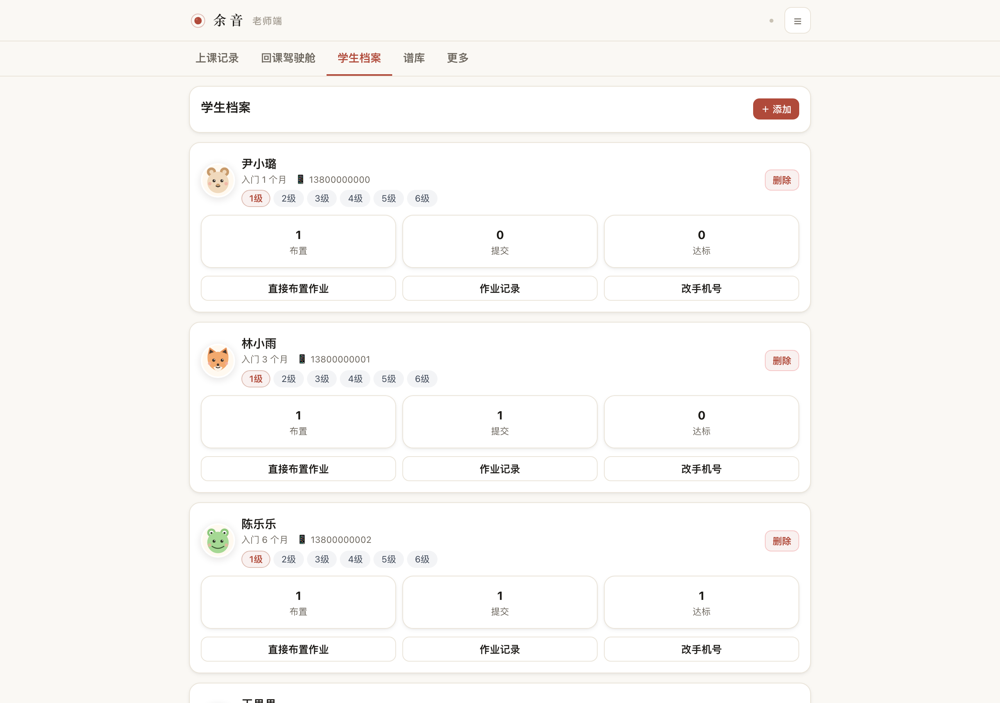
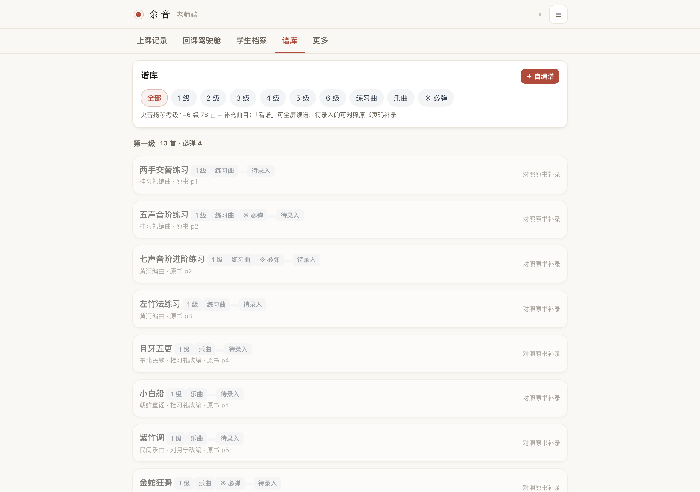
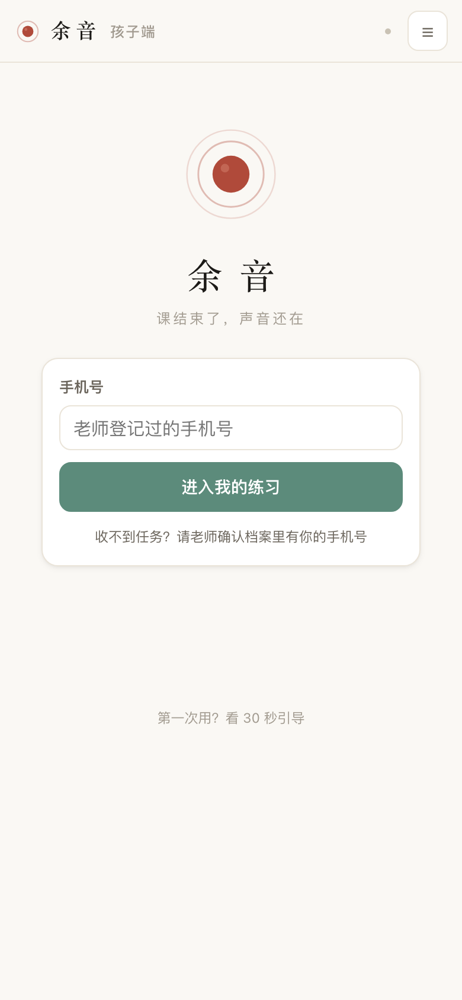

<div align="center">
  
  <h1>余 音</h1>
  <p><b>民乐老师的 AI 助教</b>（原名「扬琴 AI 助教」）</p>
  <p><i>课结束了，声音还在。</i></p>
</div>

> **一句话**：老师 3 分钟布置，孩子照着练，练完自动回到老师眼前。
>
> 一个面向民乐老师的轻量工具：把课堂上的口头指点，变成孩子回家能照着做的练琴任务卡，并且自动回收"练没练、练得稳不稳"的回课证据。

---

## 一、谁在用，怎么用

| 角色 | 在哪里用 | 干什么 | 看截图 |
|---|---|---|---|
| **民乐老师** | 老师端（桌面 / 平板） | 上课记录 → 在五线谱上点音符加批注 → 一键布置作业；回课驾驶舱看全班进度，逐条批改 |  |
| **学生** | 孩子端（手机 / 平板） | 输入老师登记的手机号登录 → 看自己的任务卡 → 照着谱面批注练 → 记遍数、计时、录音、节拍器 → 提交回课 |  |
| **家长** | 同一台孩子的手机 | 看到孩子的任务卡和老师的批注，不用再问"今天练什么" |  |

两端打开同一个网址就行，**3 秒自动同步**，录音会上传到服务器。孩子一提交，老师那边立刻看到。

---

## 二、它解决了什么问题

不是 AI 陪练，不是自动纠错——是另一件事。

```
课堂（信息产生） → 课后（指令传递） → 家庭（执行） → 回课（验证）
                        ↑                                  ↑
              老师说的话，孩子回家忘一半          练没练、练得稳不稳，老师全靠猜
```

**根因只有一句话：老师的大脑是这条链上唯一的数据库。**

所以它做的事情是——把老师脑子里的东西，外化成「家长能执行、孩子能对照、老师能验证」的练琴任务卡，并且自动回收执行证据。

---

## 三、完整功能介绍（按使用链路）

### 1. 老师端 · 上课记录 → 一键生成任务卡


打开老师端，"上课记录"页就是默认页：

- **最近课次**：每个学生最近的课、用了哪首曲子、生成了几张任务卡、老师的课堂要点
- **新建一次课**：3 步向导——① 选学生与日期 → ② 选曲目（11 首入门曲库）→ ③ 在五线谱上点音符加批注

#### 在五线谱上点音符加批注



- 自绘五线谱（不是图片，是 SVG，可以逐个音符点击）
- 点一个音符 → 选标签：**轮音 / 重点 / 难点 / 慢练 / 竹法 / 分句** 等 9 种技法
- 同一个音可以打多个标签，孩子端看到的是高亮批注

#### 布置微目标（四要素）



- **技法 · 片段 · 成功标准 · 遍数**——每条必须含这四项，孩子端会按一条条练
- 「↻ 从批注生成」一键把谱面批注转成微目标
- 一句指令（≤30 字）原样下发到孩子端，不做任何改写
- 截止日期自动算（默认 +6 天）

### 2. 老师端 · 回课驾驶舱



一张表看全班：

- **三个计数**：待回课（孩子交了老师还没批）/ 未提交（作业布置了还没练）/ 已回课（老师批过了）
- **每个孩子的回课卡片**：练了几分钟、几遍、自评怎么样、有没有录音、孩子留了什么话
- **微目标逐条**：达标数 / 3 遍、还需 N 遍达标
- **去回课** → 听录音 → 勾掉老师划的要点 → 判定（达标 / 需再练 / 不评） → 写一句话评语

### 3. 老师端 · 学生档案



- 每个学生一张卡：姓名头像、入门时长、登录手机号（**孩子用它登录**）
- 三项计数：布置 / 提交 / 达标
- 操作：直接布置作业（不进入上课流程）/ 作业记录 / 改手机号

### 4. 老师端 · 谱库



- **11 首入门曲目**：五声音阶练习、轮音长音、八度双音、琶音、小星星、两只老虎、欢乐颂、铃儿响叮当、玛丽有只小羊羔……
- 每首标注：分类（基本功 / 入门曲目）、调号、BPM、难度
- 老师布置时可一键引用

### 5. 孩子端 · 登录



- 输入老师登记过的手机号 → 登录成功并自动记住
- 孩子端默认纯绿色调（区别于老师端的橙色），操作只围绕"练"这一件事

### 6. 孩子端 · 今日任务


- 顶部是这周完成度（X/X 张任务卡）
- 每张卡：曲目、调号、遍数 / 分钟 / BPM / 截止日期、谱面批注（轮音×1、重点×1）、"看谱与要点"和"开始练习"两个按钮
- **底部是本周微目标**：每条进度条 + "还需 N 遍达标"——孩子能自己看到还要做什么

### 7. 孩子端 · 练习详情


打开"开始练习"后：

- **五线谱**：老师划的轮音（紫色框）/ 重点（红色框）高亮显示
- **老师划的重点**：列出来，一条一条对
- **计时 + 遍数 + 节拍器**：自己控制练多久、记多少遍、可选 60 BPM 节拍器辅助
- **逐条微目标**：1/3、2/3、3/3 切换，每条练完自己判断"这一遍做到了吗"——做到进度条前移
- **录音**（可选）：录一段最完整的一遍上传给老师
- **自评**：还行 / 很棒 / 卡住了——**不参与打分**，只让老师知道孩子心情
- **提交回课**：一键回到老师驾驶舱

---

## 四、三条产品红线（写代码会被打回的那种）

| # | 红线 | 为什么 |
|---|---|---|
| 1 | **AI 只做事实判断，不做价值判断** | AI 可以答「练没练 / 练得稳不稳」，**绝不**答「弹得对不对 / 好不好」。后者一旦出现，老师和家长都会失去信任。 |
| 2 | **不排名、不打百分、不评星级** | 禁止排行榜、禁止积分商城、禁止"优秀/良好/及格"。物质奖励和排名会触发过度理由效应（Deci 1971），把"我想弹"换成"我要拿分"。 |
| 3 | **不做实时打断式陪练** | 练琴被打断就会停止。产品只记录与反馈，不在练习过程中跳出来纠错。 |

练习难度按 **85% 规则**自适应（Wilson 2019, *Nature Communications* 10:4646 — 最优错误率 15.87%）。太简单无聊，太难挫败，留 15% 出错空间学得最快。

---

## 五、立即试用

### 方式 A · 线上（最快）

| 端 | 地址 |
|---|---|
| 老师端 | <https://36b79044b1854b828c41ca903625ca6c.app.workbuddy.link/t> |
| 孩子端 | <https://36b79044b1854b828c41ca903625ca6c.app.workbuddy.link/s> |

内置演示账号：

| 姓名 | 手机号 | 角色 |
|---|---|---|
| 尹小璐（置顶） | `13800000000` | 孩子端：登录后看到 1 张五声音阶练习作业 |
| 林小雨 | `13800000001` | 孩子端：1 张小星星作业（已提交，待老师回课） |
| 陈乐乐 | `13800000002` | 孩子端：1 张五声音阶作业（已批改达标） |

### 方式 B · 本地跑（推荐，数据在你手上）

```bash
cd prototype/server
node server.js          # 零依赖，Node >= 18
# 浏览器打开 http://localhost:8787/t   老师端
# 浏览器打开 http://localhost:8787/s   孩子端
```

手机要访问：电脑和手机连同一个 Wi-Fi，用电脑的局域网 IP 替换 `localhost`（`ifconfig | grep inet` 查）。

### 方式 C · 离线单文件

双击 `prototype/MVP离线单文件版.html`。老师端和孩子端在同一个页面里切换，数据存在浏览器本地——**适合演示，不适合真的多人协作**。

试用物料（`试用包/`，可直接打印或转发）：

| 文件 | 说明 |
|---|---|
| `扬琴AI助教-试用说明.html` / `.pdf` | 一页纸：两个入口二维码、演示手机号、四步上手、三条红线、5 个反馈问题、家长话术 |
| `老师端入口二维码.png` / `孩子端入口二维码.png` | 单独二维码，便于贴海报或发群 |

---

## 六、完整文档与交付物

### 文档（`docs/`）

| 文件 | 内容 |
|---|---|
| `01-市场机会深度调研.html` | 家长痛点、AI 机会、已有产品功能与商业模式 |
| `02-产品设计深度篇.html` | 功能设计与优先级 |
| `03-扬琴定制篇.html` | 落到扬琴这一个乐器上怎么做 |
| `04-竞品全景与产品战略篇.html` | 竞品拆解与战略定位 |
| `05-决策收敛书.html` | 最终定稿结论 |
| `06-需求池与前景研判.html` | 兴趣学习家庭规模与趋势 |
| `07-民乐老师AI助教方案篇.html` | 收敛到"民乐老师"的最新方案 |
| `08-孩子端动机与游戏化篇.html` | 孩子为什么练、怎么激励 |
| `PRD-产品需求文档.html` | 完整 PRD：73 条功能需求 / 20 条非功能需求 |
| `SPEC-研发规范.md` | 工程约定、WBS、微信小程序平台约束 |

每份 HTML 报告都带分级信源（A/B/C/D）、「已主动剔除的假数据」与「已知缺口」章节，可复算。

### 原型（`prototype/`）

| 文件 | 说明 |
|---|---|
| `MVP离线单文件版.html` | 双击就能开，数据存本地，适合一个人演示 |
| `server/` | **双端实时同步版**：老师端和孩子端各一个网址，数据实时互通 |

**重要约定**：`prototype/server/public/index.html` 是**唯一源文件**。`teacher.html` 和 `student.html` 由拆分脚本从它派生，不要直接改派生文件，否则下次拆分会被覆盖。

---

## 七、这条路是怎么走出来的

这个项目不是凭空做的——它是 8 卷市场调研 + 1 份 PRD + 1 份 SPEC + 1 个可运行原型的完整闭环：

1. **市场调研**（`docs/01`–`08`）：从音乐教育市场的真实数字出发——2024 年 1554.8 亿产值、2025 年 -5.5%、扬琴在学 5–40 万、师生比 30:1、出生人口 -17%——逐步收敛到"民乐老师的 AI 助教"这个具体方向
2. **PRD / SPEC**：73 条功能需求 + 20 条非功能需求；三条红线写进 SPEC 第 17 节
3. **原型**：HTML / Node 零依赖，能跑通"上课记录 → 谱面批注 → 布置作业 → 孩子练习 → 提交回课 → 老师批改"完整链路

**关键发现**：

- 真人 1v1 陪练已被证伪（师资成本 >60% + 获客 ~50% → 结构性亏损 >30%）
- 硬件 + 重度 AI 纠错也被证伪（音乐笔记 2017 年 A 轮后再无融资）
- **扬琴第一痛点是调音不是陪练**，与钢琴相反——这是入口设计的关键
- 儿童池子不可逆塌缩：2025 出生人口 -17%，义务教育适龄儿童 2025–2035 降 50–60%
- **真正缺的是教学记忆的外化系统**，不是更聪明的纠错

---

## 八、已知缺口（不装的）

- 老师付费意愿（¥398–998）目前没有直接证据，只有间接对标（Tonara $9.99–12/月）
- "民乐在学 1500 万"这个口径可能高估可服务市场 3–5 倍（按师生比反推，活跃学生仅 280–490 万）
- 扬琴天花板：3 年 SOM 约 ¥300 万/年 —— **撑得起高毛利工作室，撑不起融资公司**
- 暂未跑通真实 V0.1 验证（微信群 + 表格手动跑 5–10 学生 4 周，回课率 <40% 则整套方案作废）—— 跑通之前不要写更多代码

下一步要验证的事（0 元，现在就能做）：

| 编号 | 动作 | 判定标准 |
|---|---|---|
| E1 | 记两周真实练琴日志 | — |
| E2 | 访谈 3–5 位家长 | — |
| **E3** | **调音实测（最关键，只有扬琴老师能做）** | 耗时 <15 分钟 且 放弃率 <30%，否则方向要重设计 |
| T1 | 用微信群 + 表格手动跑 5–10 个学生，4 周 | 回课率 <40% 则整套方案作废 |

---

## 九、数据口径

- 所有数值类结论先跑脚本验算再写进报告，假设全部公开，可复算
- 信源分四级：**A** 官方/协会/上市公司财报 ｜ **B** 权威媒体与研究报告 ｜ **C** 行业媒体与公开访谈 ｜ **D** 推算（假设已注明）
- 每份报告末尾有完整信源清单，正文带引用角标
- 互相矛盾的数据（例如某文档农场口径的"扬琴机构 2.8 万家"）已主动剔除并说明理由

---

## 十、许可

代码与原型：MIT。
文档内容：转载请注明出处。

---

*最后更新：2026-09-09*