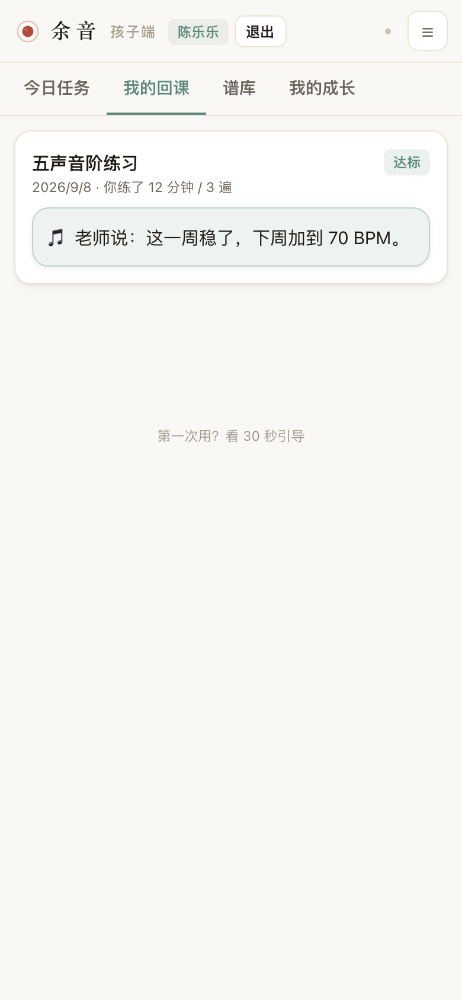

<div align="center">
  
  <h1>余 音</h1>
  <p><b>民乐老师的 AI 助教</b></p>
  <p><i>课结束了，声音还在。</i></p>
</div>

**一句话**：老师 3 分钟布置，孩子照着练，练完自动回到老师眼前。

把课堂上的口头指点，变成孩子回家能照着做的练琴任务卡，并自动回收"练没练、练得稳不稳"的回课证据——不是 AI 陪练，不是自动纠错。

---

## 核心亮点

### 1 · 在五线谱上点音符 = 课堂批注

点谱面上任意音符，打上 **轮音 / 重点 / 难点 / 慢练 / 竹法 / 分句** 等 9 种技法标签。孩子端看到的是高亮批注——不用再猜"老师上课说的那句到底是什么意思"。


### 2 · 微目标四要素：技法 · 片段 · 成功标准 · 遍数

每条作业必须含这四项，孩子端按一条条练、达标才结算。一句指令（≤30 字）原样下发、不做改写，截止日期自动算；「从批注生成」一键把谱面批注转成微目标。


### 3 · 回课驾驶舱：一张表看全班

待回课 / 未提交 / 已回课三个数；每个孩子练了几分钟、几遍、自评如何、有没有录音，一目了然。听录音 → 勾要点 → 达标/需再练 → 一句话评语。


### 4 · 孩子端只做一件事：照着练

任务卡 → 谱面批注对照 → 计时 / 记遍数 / 节拍器 → 逐条微目标圆点点亮 → 一键提交回课。本周进度是"0/3"的圆点阵——**不排名、不打百分、不评星级**。


### 5 · 老师批改，当天回到孩子手里

达标 / 需再练 + 一句话评语，孩子端"我的回课"直接看到——补上闭环的最后一环。



---

## 三条产品红线

| # | 红线 |
|---|---|
| 1 | AI 只做事实判断（练没练、稳不稳），**绝不**判断"弹得对不对、好不好" |
| 2 | 不排名、不打百分、不评星级——保护"我想弹"的内在动机 |
| 3 | 不做实时打断式陪练——练琴被打断就会停止 |

---

## 立即试用

| 端 | 地址 |
|---|---|
| 老师端 | <https://36b79044b1854b828c41ca903625ca6c.app.workbuddy.link/t> |
| 孩子端 | <https://36b79044b1854b828c41ca903625ca6c.app.workbuddy.link/s> |

演示手机号（孩子端登录）：`13800000000` 尹小璐 · `13800000001` 林小雨（已提交待批） · `13800000002` 陈乐乐（已批改达标）

本地跑（零依赖，Node ≥ 18）：

```bash
cd prototype/server && node server.js
# 老师端 http://localhost:8787/t   孩子端 http://localhost:8787/s
```

---

## 更多

- **完整文档**（`docs/`）：8 卷市场调研 + PRD（73 条功能需求）+ 研发 SPEC，全部带分级信源与可复算假设
- **离线单文件**：`prototype/MVP离线单文件版.html` 双击即开，适合演示
- 完整链路：上课记录 → 谱面批注 → 布置作业 → 孩子练习 → 提交回课 → 老师批改

代码与原型：MIT ｜ 文档内容：转载请注明出处

---

*最后更新：2026-09-09*
